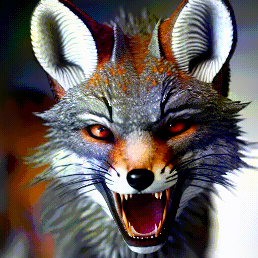
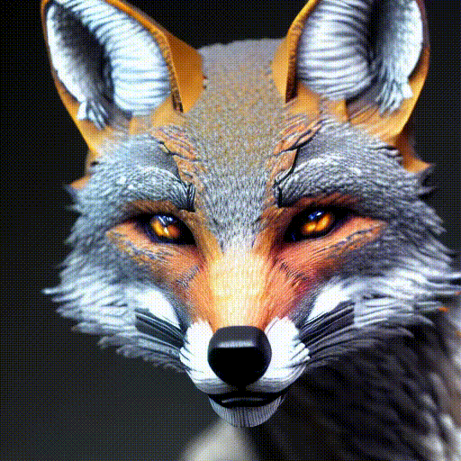

# Video Generation using Large Language Models
Do you enjoy running text-to-video generation codes on Google Colab as much as I do? 

Try [this Notebook](https://github.com/nimamasoumi/LLM-Video-Gen/blob/main/llm-video-gen.ipynb) in Colab and explore the enabling possibilities.

This repository provides a Jupyter Notebook and inference files of [Text2Video-Zero](https://arxiv.org/abs/2303.13439), which are executable on Google Colab.

The official source codes are provided in the [Text2Video GitHub](https://github.com/Picsart-AI-Research/Text2Video-Zero). 

Below are the examples that I created using the source codes:

<table class="center" style="width:70%; height:70%">
<tr>
  <td></td>
  <td></td>
  <td></td>
  <td></td>
</tr>
</table>

Following example was created using Hugging Face page of the official repository:

## What I learned using this text-to-video method?
<ol>
<li>Certain poses are better illustrated e.g. horse galloping or moving animals toward the camera.</li>
<li>The generation of complex poses usually fails, e.g. an animal slowly turns the head from left to right.</li>
<li>Generated videos of humans are not realistic, e.g. I tried Elon Musk and it did not go well. </li>
<li>Results are usually a close-up and focused to the described subjects, and the background is missing. </li>
<li>The videos containing flows of water can be very similar to an animated paining.</li>
<li>In general, the videos are like animated painting, regardless of the generation prompt. </li>
</ol>

